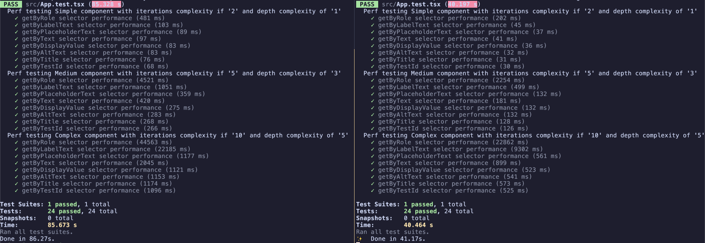
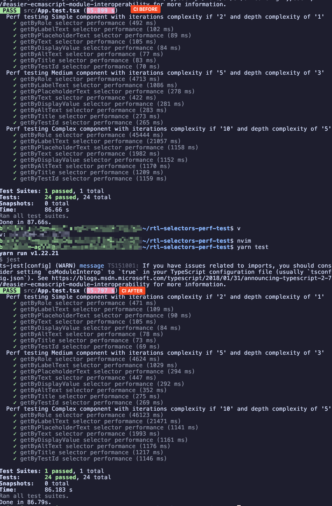
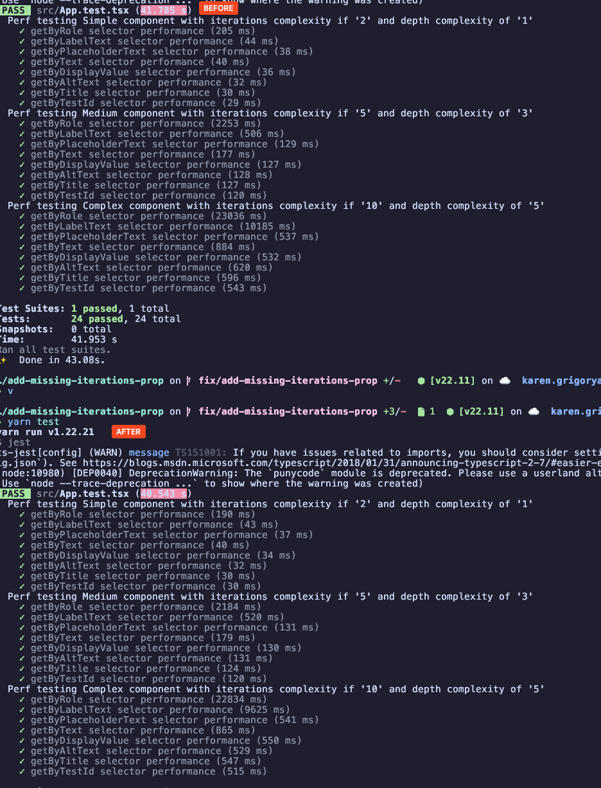

# RTL accessibility selectors perf test

## Description

React-testing library has been created with a purpose to enforce
testing style that is more aligned with how users interact with the
application. This is why it is [recommending](https://testing-library.com/docs/queries/about#priority)
to use accessibility selectors to query elements in the DOM using
accessibility selectors first, and only if it is not possible, to use
other selectors like `data-testid`.

This is a good practice, but it has a hidden cost - performance.

This repository is created to measure the exact algorithmic impact of
using accessibility selectors over other selectors. We measure the
progression of complexity which is otherwise usually hidden when
doing one-off benchmarks.

## How we setup and measure

The source code is contained within `App.tsx` file. It accepts a
a single prop `iterations` which is used to render a list of `iterations` amount
of components that are essentially the same. Each component has 2 parts:
visible and hidden. The visible part is supposed to be clicked on, while
the hidden part is supposed to be selected after the click.

In the tests we use RTL selectors one by one to select by a given selector
then visible part of the component, and then after the click we wait and
select the hidden part of the component.

We split tests into 3 complexity tiers: Simple, Medium and Complex.

Simple tier uses 2 iterations, Medium uses 5 iterations and Complex uses 10 iterations.
I.e. we render a list of 2, 5 and 10 composite components respectively.
Since this would be too trivial we also add additional complexity by nesting
the components and adding a lot of noise in the form of other or similar elements
with similar attributes containing similar text to see how much is RTL selection
logic affected by this with each selector.

The picked rule is to wrap and nest the components in `Math.ceil(iterations / 2)`
amount of noise elements to keep the tests running a little faster yet still
show the significance of the progressive impact in each tier. And we also add
`iterations` amount of noise elements sibling to the composite components,
to show that even when there is no nesting the RTL selection logic is still
affected by the amount of elements that it has to traverse to find the correct one.

## Things to consider

To make sure the impact is properly considered make sure to run the suite
not only on cutting edge hardware like latest m-series macbook pro, but
also on CI/CD agents which are generally significantly slower.

For example, a 16gb 4-core CI agent machine can be up to 2x or more
slower than the latest m-series macbook pro. So
seemingly benign local jest run perf result can turn out to be a
visible bottleneck for the CI/CD pipeline.

## Preliminary results

Here are the preliminary results from CI agent vs local m3 pro run:

## Default hidden case

Following the classic [discussion](https://github.com/testing-library/dom-testing-library/issues/552) about slow selectors in RTL, we also tested the recommendation to use `configure({ defaultHidden: true })` to speed up the selectors. The results further prove
that there is negligible algorithmic perf difference in performance between the selectors when the defaultHidden is set to true on a fast modern laptop and even more so on a slower CI agent.

**CI agent results**

**Local macbook results**

Another thing to keep in mind is that `hidden` option is only applicable to `ByRole` queries, and not to `ByLabelText` queries. So if you are using `ByLabelText` queries, you will not see any performance improvement from setting `defaultHidden` to true or individual `hidden` option to true.
